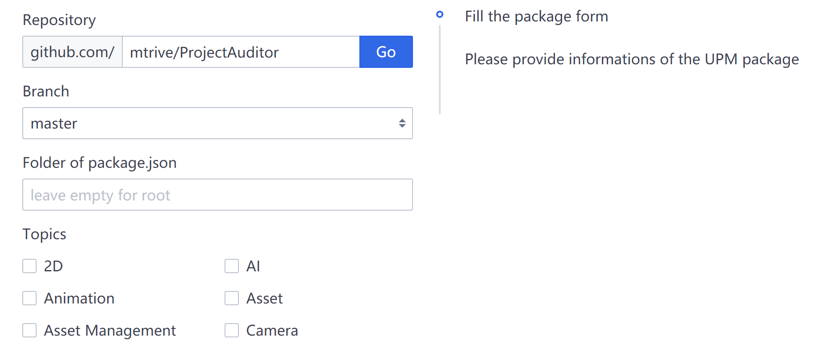

# Adding UPM Package

## UPM Package Criteria

OpenUPM requires the package repository fulfils below criteria
- The valid UPM structure. At least contains a `package.json` file, can be placed at a sub-folder.
- An open source license. It is recommended to choose one from the [spdx license list](https://spdx.org/licenses/).
- Hosting on Github. For now only GitHub repositories are supported, but the generic git support is under consideration.
- Git tags that are valid semver, with/without the `v` prefix. i.e. `v1.1.0`, `1.1.0`, `1.1.1-preview`, `v2.0.0-preview.1`. Only valid tags are built. It is recommended to either using the GitHub release feature, or CI tools to create git tags.

## Understanding Different Folder Structures of UPM Repositories

There're three typical folder structures of UPM repositories. OpenUPM build pipelines can handle all of them.

- UPM package at the root path
- UPM package at a sub-folder
- UPM package at a sub-folder with UPM branch

### UPM Package at the Root Path

The `package.json` file is located at the root path of the master branch. It is the simplest case.

### UPM Package at a Sub-folder

The master branch is usually an Unity project (with Assets folder). The `package.json` file is located at a sub-folder, for example `Assets/package-name` or `Packages/com.namespace.package-name`. Git tags are based on the master branch. Build pipelines will detect the location of the `package.json` file, and handle it correctly.

### UPM Package at a Sub-folder with UPM Branch

The master branch is usually an Unity project (with Assets folder). The `package.json` file is located at a sub-folder, for example `Assets/package-name` or `Packages/com.namespace.package-name`. An `upm` branch is created from the package folder using the `git subtree split/push` command to make the `package.json` file placed at the root path. So the package can be installed by Unity Package Manager via git url. Git tags are based on the upm branch.

## Package YAML File

OpenUPM uses a yaml file to store the package information. Here's an example.

```yaml
# package name
name: com.namespace.unitypackageexample
# package display name
displayName: Unity Package Example
# package description
description: An unity package example
# repository url
repoUrl: 'https://github.com/favoyang/unity-package-example'
# repository branch
repoBranch: master
# forked repository url
parentRepoUrl: null
# spdx license id
licenseSpdxId: MIT
# license name
licenseName: MIT License
# list of topic slugs
topics:
  - utility
# package hunter name (github username)
hunter: favoyang
# excluded from package list
excludedFromList: false
```

## Using Package Add Form

Package hunters can use the [package add form](/packages/add/), to submit the package yaml file. The form will guide you to fill required information, generate the yaml file, then submit to GitHub as pull request in the browser.

[](/packages/add/)

The pull request of adding new package will be merged automatically. The CI will do jobs to update the website and build pipelines. Within a few minutes you can view the package detail page at url `/packages/com.namespace.package-name`, and check the build result from the **version history** and **build issues** sections.

@flowstart
form=>operation: Fill the package form
pr=>operation: Start a pull request
ci=>operation: Wait the CI

form->pr
pr->ci
@flowend

## Troubleshooting

### Handling the Repository without Git Tags

Please create an issue on the author's repository for making GitHub releases. The git tag should be a valid semver.

### Handling Failed Builds

You can view the reason of failed build at build issues section of the package detail page. The most common issue is *version conflict*, means a package with with same version already exists. The package owner need bump the version with a new GitHub release, or retag the existing release. Build pipelines will rebuild a failed release if detecting that the git tag is removed or retagged.

However, build pipelines will not rebuild a already succeeded release if detecting that the git tag is removed or retagged. Because it's a bad practice for talking off or replacing an existing release for a public registry. If the intention is to fix something, the packager owner is recommended to bump the version with a new git tag. For the rare case, please [create an issue](https://github.com/openupm/openupm/issues) for unpublishing.

### Handling the Custom Build Script

Build pipelines simply detect the package folder, and run the `npm publish` command in that folder to publish a package. If what you want is to exclude certain files from the package bundle, you can use the `.npmigore` file at the same path of the `package.json` file. Learn more [here](https://docs.npmjs.com/misc/developers#keeping-files-out-of-your-package).

The custom build script is not supported at the moment. We're looking for an candidate repository to work with to support the custom build script. If your package do need the feature, please [create an issue](https://github.com/openupm/openupm/issues) to start a conversation.
