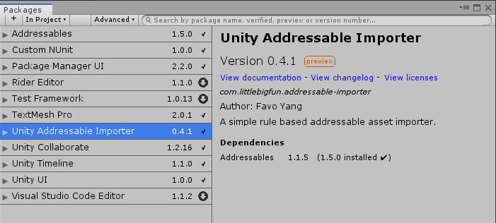

# Getting Started

The article is a step-by-step tutorial, shows how to install openupm-cli and use it to manipulate package manifest.

## Install Openupm-cli

Openupm-cli requires [Node.js 12](https://nodejs.org/en/). If you don't have it installed, please download and install the latest version.

Now open your favorite terminal. Thanks to the cross platform feature of Node.js, openupm-cli can work in various terminal environments like bash for Mac and Linux, or git-bash, cmd and powershell for Windows.

::: tip
This article uses [git-bash for windows](https://gitforwindows.org/) and [ConEmu](https://conemu.github.io/) for demonstration
:::

Let's verify the Node.js installation by printing the npm version (node package manager where upm is inspired from).

```sh
$ npm -v
6.13.4
```

Global install openupm-cli, so you can use it from any path.

```sh
$ npm install -g openupm-cli
C:\Users\openupm\AppData\Roaming\npm\openupm -> C:\Users\openupm\AppData\Roaming\npm\node_modules\openupm-cli\bin\openupm + openupm-cli@1.1.0
updated 2 packages in 12.177s
```

Let's test the openupm-cli installation by printing the version.

```sh
$ openupm --version
1.1.0
```

## Create an Unity Project

Next step is creating an Unity project. Using existing project also works. To make it clear, let's create an empty project located at path `~/Document/projects/hello-openupm`.

## Install Package

Let's install `Unity Addressable Importer` a helper package to manage addressable assets. First let's find the accurate package name.

```sh
# go to the unity project folder
$ cd ~/Document/projects/hello-openupm

# search package by keyword
$ openupm search addressable
fast search endpoint is not available, using old search.
┌───────────────────────────────────────┬─────────┬───────────┬────────────┐
│ Name                                  │ Version │ Author    │ Date       │
├───────────────────────────────────────┼─────────┼───────────┼────────────┤
│ com.littlebigfun.addressable-importer │ 0.4.1   │ Favo Yang │ 2019-12-10 │
│ Unity Addressable Importer            │         │           │            │
└───────────────────────────────────────┴─────────┴───────────┴────────────┘
```

It shows both package name `com.littlebigfun.addressable-importer` and display name `Unity Addressable Importer`.

::: tip
To discover new open source upm package, better to use the search box on the website
:::

Let's install the package by `add` command and providing package name.

```sh
$ openupm add com.littlebigfun.addressable-importer
added: com.littlebigfun.addressable-importer@0.4.1
manifest updated, please open unity project to apply changes
```

It shows the package version 0.4.1 was added to the manifest file.

::: warning Notice
As of December 2019, the openupm-cli only add package and scope info to manifest file. It won't directly resolve package dependencies and download tarballs. Unity package manager did all the hard work underlying.
:::

Go back to unity editor, wait the package manager resolves package changes. Then you shall see the `com.littlebigfun.addressable-importer` shows in the package manager window.


Notice the dependency `Addressbles` is also installed, but not shown in the `In Project` list. Because it's not the direct dependency of the project. If you want to use the latest version, you shall find it in the `All packages` list, and upgrade it from there. Or you can use openupm-cli to install the latest version.

```sh
$ openupm add com.unity.addressables
added: com.unity.addressables@1.5.0
manifest updated, please open unity project to apply changes
```
Go back to unity editor, wait the package manager resolves package changes. Then you shall see the `Addressables` shows in the package manager window. Though `Unity Addressable Importer` only requires the version `1.1.5`, but `1.5.0` was installed.



## Extended Reading

To understand the underlying changes of manifest file, let's print the json content.

```json
$ cat Packages/manifest.json
{
  "dependencies": {
    ...
    "com.littlebigfun.addressable-importer": "0.4.1",
    "com.unity.addressables": "1.5.0"
  },
  "scopedRegistries": [
    {
      "name": "package.openupm.com",
      "url": "https://package.openupm.com",
      "scopes": [
        "com.littlebigfun.addressable-importer",
        "com.openupm"
      ]
    }
  ]
}
```

The openupm-cli add both `com.littlebigfun.addressable-importer` and `com.unity.addressables` to dependencies. And since `com.littlebigfun` is the only namespace hosting on openupm registry, it was added to the scoped registry list.

Please visit [openupm-cli readme](https://github.com/openupm/openupm-cli#openupm-cli) for more usage.